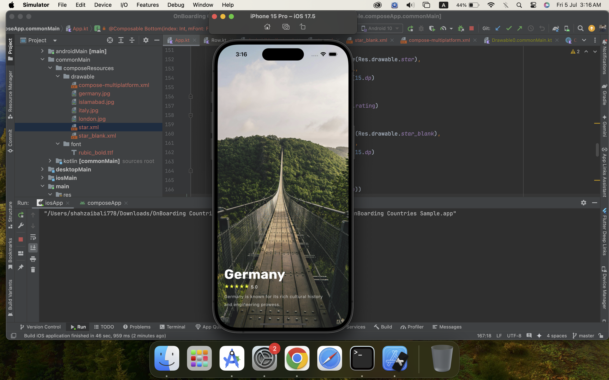
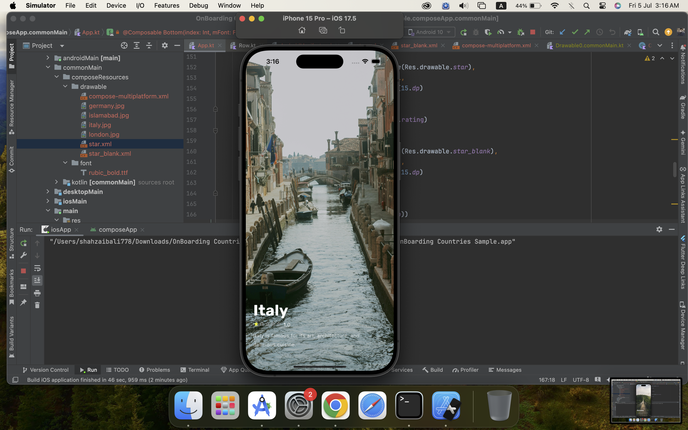

# Countries App using Compose Multiplatform
This is a simple countries app built with Kotlin Multiplatform (KMP) using Jetpack Compose for UI. This app have different animations
## Screenshots





## Installation

1. Clone the repository:
```bash
git clone https://github.com/ShahzaibAli02/OnBoardingCountriesSample.git
```